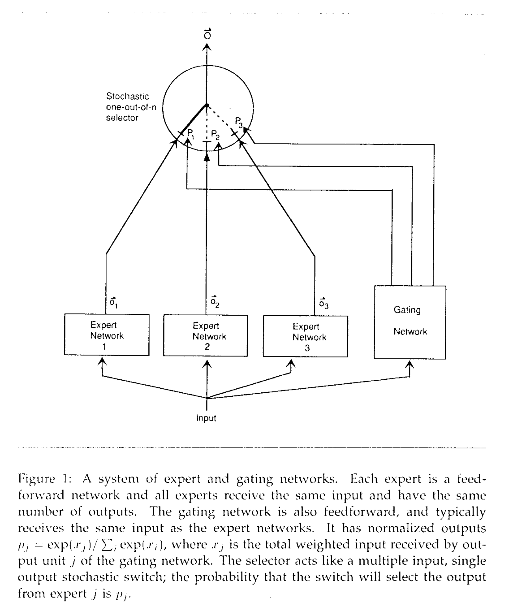

# [Blog] What are Mixture of Experts (MoE) ?

> **Date published:** TBD

<!--
Background
- Need for mixture of experts.
- History of MoE and how old is the concept
  - Initial results in 1990s
-->
Jacobs et. al introduced the idea of mixture of local experts back in 1991 [[1]](#first_paper). Since then, we have come a long way - both in the compute available and the research that has happend on this topic.

Mixture of Experts (MoE) is a training paradigm where a model can dynamically allocate the computation to some parts of the model. These parts (experts) learn some important aspect about the data and work together (with one ore more experts) to produce the final output.

Let us look at how this can looks like in a transformer based architecture in [`Figure 1`](#basic_moe).

<!-- 
Thought experiment on MoE - Understanding the concept using basic example.
-->

<!-- MoE for deep learning -->

## References
<a id="first_paper">[1]</a> 
Adaptive Mixture of Local Experts ([arXiv](https://www.cs.toronto.edu/~hinton/absps/jjnh91.pdf))

<a id="2">[2]</a> 

